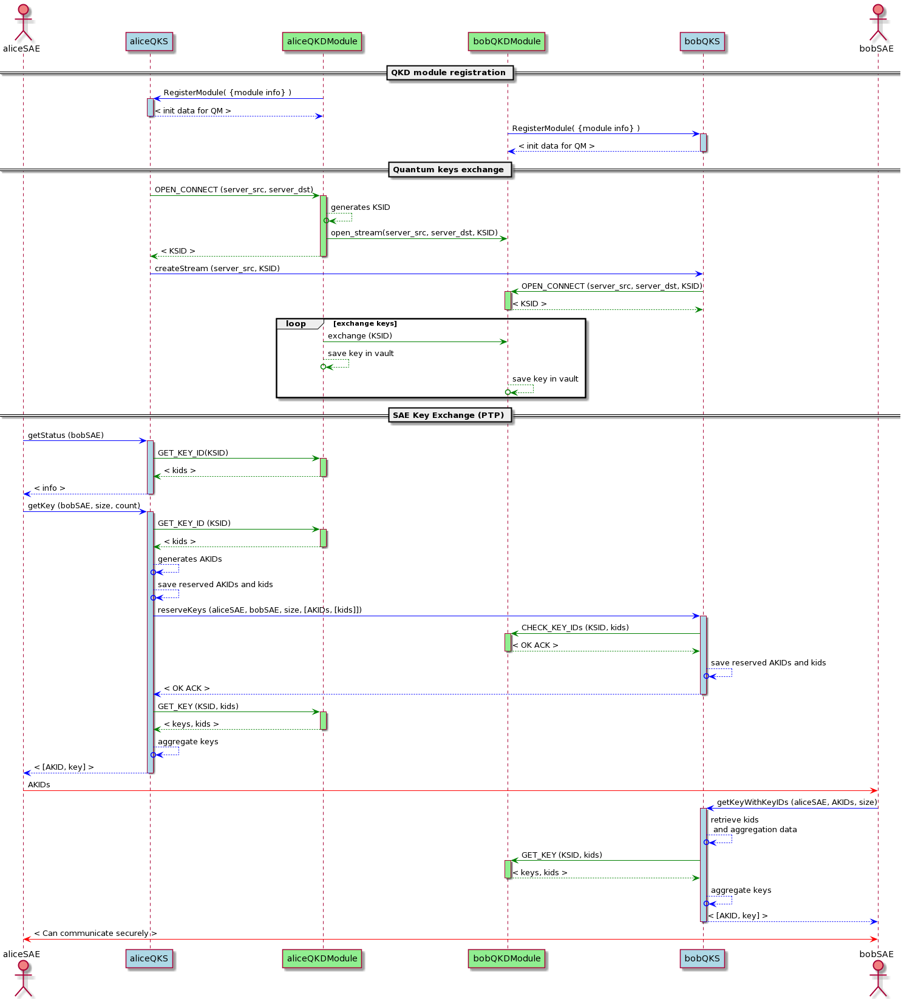
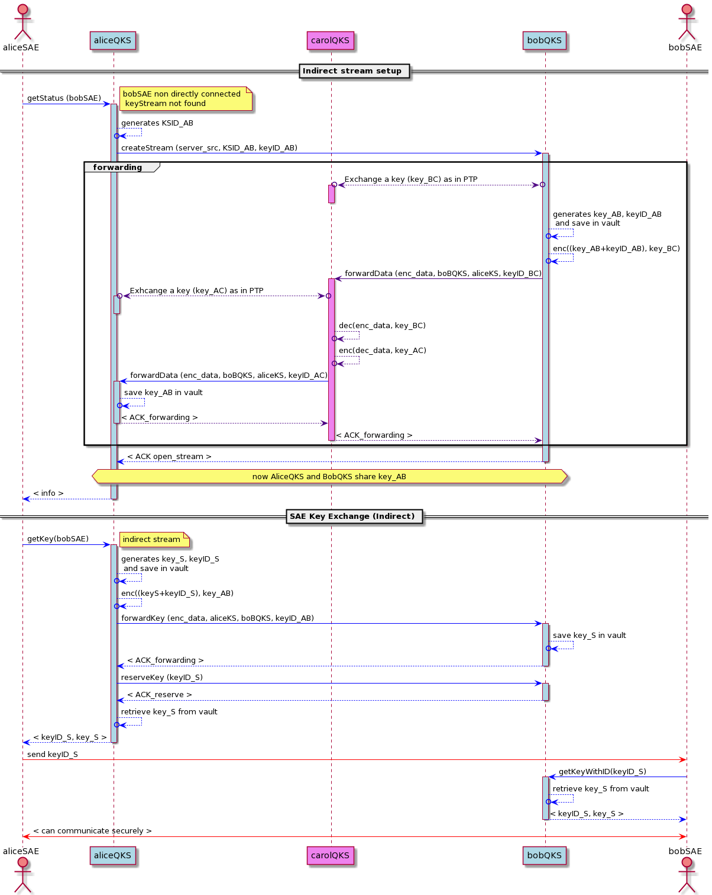

# Pictures
## QKD Key Exchange (PTP) 

## Indirect Key Exchange (TN) 

# PlantUML code
## QKD Key Exchange (PTP) 

@startuml
actor aliceSAE as ASAE order 1 #lightCoral
actor bobSAE as BSAE order 6 #lightCoral
participant aliceQKS as AQKS order 2 #LightBlue
participant bobQKS as BQKS order 5 #LightBlue
participant aliceQKDModule as AQM order 3 #LightGreen
participant bobQKDModule as BQM order 4 #LightGreen

== QKD module registration ==

AQM -[#blue]> AQKS : RegisterModule( {module info} )
activate AQKS #LightBlue
AQKS -[#blue]-> AQM : < init data for QM >
deactivate AQKS 

BQM -[#blue]> BQKS : RegisterModule( {module info} )
activate BQKS #LightBlue
BQKS -[#blue]-> BQM : < init data for QM >
deactivate BQKS

== Quantum keys exchange == 
AQKS -[#green]> AQM : OPEN_CONNECT (server_src, server_dst)
activate AQM #LightGreen
AQM --[#green]>o AQM : generates KSID
AQM -[#green]> BQM : open_stream(server_src, server_dst, KSID)
AQM --[#green]> AQKS : < KSID >
deactivate AQM
AQKS -[#blue]> BQKS : createStream (server_src, KSID) 

BQKS -[#green]> BQM : OPEN_CONNECT (server_src, server_dst, KSID) 
activate BQM #LightGreen
BQM --[#green]> BQKS : < KSID >
deactivate BQM
loop exchange keys
    AQM -[#green]> BQM : exchange (KSID)
    AQM --[#green]>o AQM : save key in vault
    BQM --[#green]>o BQM : save key in vault
end

== SAE Key Exchange (PTP) == 
ASAE -[#blue]> AQKS : getStatus (bobSAE)
activate AQKS #LightBlue
AQKS -[#green]> AQM : GET_KEY_ID(KSID)
activate AQM #LightGreen
AQM -[#green]-> AQKS : < kids >
deactivate AQM
AQKS -[#blue]-> ASAE : < info >
deactivate AQKS

ASAE -[#blue]> AQKS : getKey (bobSAE, size, count) 
activate AQKS #LightBlue
AQKS -[#green]> AQM : GET_KEY_ID (KSID)
activate AQM #LightGreen
AQM -[#green]->AQKS : < kids > 
deactivate AQM
AQKS -[#blue]->o AQKS : generates AKIDs
AQKS -[#blue]->o AQKS : save reserved AKIDs and kids
AQKS -[#blue]> BQKS : reserveKeys (aliceSAE, bobSAE, size, [AKIDs, [kids]]) 
activate BQKS #LightBlue
BQKS -[#green]> BQM : CHECK_KEY_IDs (KSID, kids)
activate BQM #LightGreen
BQM -[#green]-> BQKS : < OK ACK >
deactivate BQM
BQKS -[#blue]->o BQKS : save reserved AKIDs and kids
BQKS -[#blue]-> AQKS : < OK ACK >
deactivate BQKS 
 
AQKS -[#green]> AQM : GET_KEY (KSID, kids) 
activate AQM #LightGreen
AQM -[#green]-> AQKS : < keys, kids >
deactivate AQM 
AQKS -[#blue]->o AQKS : aggregate keys
AQKS -[#blue]-> ASAE : < [AKID, key] >
deactivate AQKS
ASAE -[#red]> BSAE :  AKIDs 
BSAE -[#blue]> BQKS : getKeyWithKeyIDs (aliceSAE, AKIDs, size)
activate BQKS #LightBlue
BQKS -[#blue]->o BQKS : retrieve kids \n and aggregation data
BQKS -[#green]> BQM : GET_KEY (KSID, kids) 
activate BQM #LightGreen
BQM -[#green]-> BQKS : < keys, kids > 
deactivate BQM
BQKS -[#blue]->o BQKS : aggregate keys
BQKS -[#blue]-> BSAE :  < [AKID, key] >
deactivate BQKS 
ASAE <-[#red]> BSAE: < Can communicate securely > 

@enduml

## QKD SAE Key Exchange (Trusted Node ) 
@startuml
actor aliceSAE as ASAE order 1  #lightCoral
actor bobSAE as BSAE order 5  #lightCoral
participant aliceQKS as AQKS order 2 #LightBlue
participant bobQKS as BQKS order 4 #LightBlue
participant carolQKS as CQKS order 3 #violet

== Indirect stream setup == 
ASAE -[#blue]> AQKS : getStatus (bobSAE)
activate AQKS #LightBlue
note right: bobSAE non directly connected \n keyStream not found 
AQKS -[#blue]->o AQKS : generates KSID_AB
AQKS -[#blue]> BQKS : createStream (server_src, KSID_AB, keyID_AB)
activate BQKS #LightBlue

group forwarding
BQKS o<-[#indigo]->o CQKS :  Exchange a key (key_BC) as in PTP
activate CQKS #violet
deactivate CQKS 
BQKS -[#blue]->o BQKS : generates key_AB, keyID_AB \n and save in vault
BQKS -[#blue]->o BQKS : enc((key_AB+keyID_AB), key_BC)
BQKS -[#indigo]> CQKS : forwardData (enc_data, boBQKS, aliceKS, keyID_BC) 
activate CQKS #violet

CQKS o<-[#indigo]->o AQKS : Exhcange a key (key_AC) as in PTP
activate AQKS #LightBlue
deactivate AQKS
CQKS -[#indigo]->o CQKS : dec(enc_data, key_BC)
CQKS -[#indigo]->o CQKS : enc(dec_data, key_AC)
CQKS -[#blue]> AQKS : forwardData (enc_data, boBQKS, aliceKS, keyID_AC) 
activate AQKS #LightBlue
AQKS -[#blue]->o AQKS : save key_AB in vault
AQKS -[#indigo]-> CQKS : < ACK_forwarding >
deactivate AQKS 
CQKS -[#indigo]-> BQKS : < ACK_forwarding >
deactivate CQKS
end

BQKS -[#blue]-> AQKS : < ACK open_stream > 
deactivate BQKS
hnote over AQKS,BQKS : now AliceQKS and BobQKS share key_AB 
AQKS -[#blue]-> ASAE : < info >
deactivate AQKS

== SAE Key Exchange (Indirect) == 

ASAE -[#blue]> AQKS : getKey(bobSAE) 
activate AQKS #LightBlue
note right: indirect stream
AQKS -[#blue]->o AQKS : generates key_S, keyID_S \n and save in vault
AQKS -[#blue]->o AQKS : enc((keyS+keyID_S), key_AB)
AQKS -[#blue]> BQKS : forwardKey (enc_data, aliceKS, boBQKS, keyID_AB)  
activate BQKS #LightBlue
BQKS -[#blue]->o BQKS :save key_S in vault
BQKS -[#blue]-> AQKS : < ACK_forwarding >
deactivate BQKS
AQKS -[#blue]> BQKS : reserveKey (keyID_S)
activate BQKS #LightBlue
BQKS -[#blue]-> AQKS : < ACK_reserve >
deactivate BQKS
AQKS -[#blue]->o AQKS : retrieve key_S from vault
AQKS -[#blue]-> ASAE : < keyID_S, key_S >
deactivate AQKS
ASAE -[#red]> BSAE : send keyID_S
BSAE -[#blue]> BQKS : getKeyWithID(keyID_S)
activate BQKS #LightBlue
BQKS -[#blue]->o BQKS : retrieve key_S from vault
BQKS -[#blue]-> BSAE : < keyID_S, key_S >
deactivate BQKS
ASAE <-[#red]> BSAE : < can communicate securely >

@enduml

