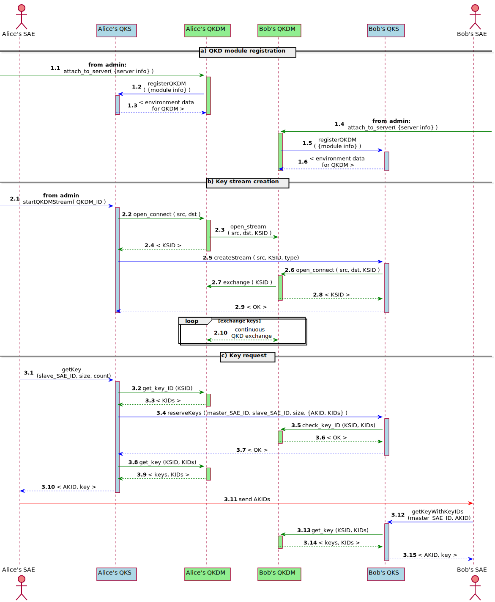
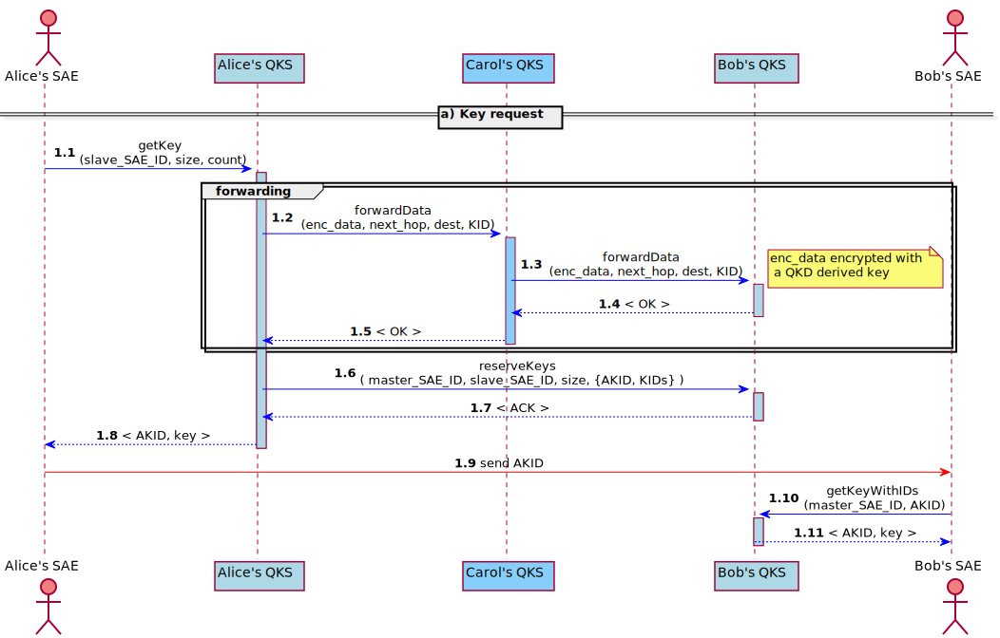

# Pictures
## QKD Key Exchange (PTP) 

## Indirect Key Exchange (TN) 

# PlantUML code
## QKD Key Exchange (PTP) 

@startuml
skinparam sequenceMessageAlign center
actor "Alice's SAE" as ASAE order 2 #lightCoral
actor "Bob's SAE" as BSAE order 7 #lightCoral
participant "Alice's QKS" as AQKS order 3 #LightBlue
participant "Bob's QKS" as BQKS order 6 #LightBlue
participant "Alice's QKDM" as AQM order 4 #LightGreen
participant "Bob's QKDM" as BQM order 5 #LightGreen

== QKD module registration ==
autonumber 1.1
 [-[#green]> AQM ++ #LightGreen:**admin** attach_to_server( {server info} ) 
AQM -[#blue]> AQKS ++ #LightBlue: registerQKDM( {module info} )
AQKS -[#blue]-> AQM --: < environment data for QKDM >
deactivate AQM
BQM <[#green]-] ++ #Lightgreen: **admin** attach_to_server( {server info} )
BQM -[#blue]> BQKS ++ #LightBlue: registerQKDM( {module info} )
BQKS -[#blue]-> BQM --:  < environment data for QKDM >
deactivate BQM

== Key stream creation == 
autonumber inc A

[-[#blue]> AQKS ++ #lightblue: **admin** startQKDMStream( QKDM_ID )
AQKS -[#green]> AQM ++ #lightgreen: open_connect ( src, dst )
AQM -[#green]> BQM : open_stream(  src, dst, KSID )
AQM --[#green]> AQKS --: < KSID >
AQKS -[#blue]> BQKS ++ #lightblue: createStream ( src, KSID, type) 
BQKS -[#green]> BQM ++ #lightgreen: open_connect ( src, dst, KSID ) 
BQM -[#green]> AQM : exchange ( KSID )
BQM --[#green]> BQKS -- : < KSID >
BQKS --[#blue]> AQKS -- : < OK >
deactivate AQKS

loop exchange keys
    AQM <-[#green]-> BQM : continuous QKD exchange
end

== Key request == 
autonumber inc A

ASAE -[#blue]> AQKS ++ #LightBlue: getKey (slave_SAE_ID, size, count) 
AQKS -[#green]> AQM ++ #LightGreen: get_key_ID (KSID)
AQM -[#green]->AQKS --: < KIDs > 
AQKS -[#blue]> BQKS ++ #LightBlue: reserveKeys ( master_SAE_ID, slave_SAE_ID, size, {AKID, KIDs} ) 
BQKS -[#green]> BQM ++ #LightGreen: check_key_id (KSID, KIDs)
BQM -[#green]-> BQKS -- : < OK >
BQKS -[#blue]-> AQKS --: < OK >
AQKS -[#green]> AQM ++ #LightGreen: get_key (KSID, KIDs) 
AQM -[#green]-> AQKS --: < keys, KIDs >
AQKS -[#blue]-> ASAE --: < AKID, key >

ASAE -[#red]> BSAE :  send AKIDs  
BSAE -[#blue]> BQKS ++ #LightBlue: getKeyWithKeyIDs (master_SAE_ID, AKID)
BQKS -[#green]> BQM ++ #LightGreen: get_key (KSID, KIDs) 
BQM -[#green]-> BQKS --: < keys, KIDs > 
BQKS -[#blue]-> BSAE -- :  < AKID, key >

@enduml

## QKD SAE Key Exchange (Trusted Node ) 
@startuml

skinparam sequenceMessageAlign center
actor aliceSAE as ASAE order 1  #lightCoral
actor bobSAE as BSAE order 5  #lightCoral
participant aliceQKS as AQKS order 2 #LightBlue
participant bobQKS as BQKS order 4 #LightBlue
participant carolQKS as CQKS order 3 #lightskyblue

== Indirect stream creation == 
autonumber 1.1
ASAE -[#blue]> AQKS ++ #LightBlue: getStatus (bobSAE)
note right: bobSAE non directly connected \n keyStream not found 
AQKS -[#blue]> BQKS ++ #lightblue : createStream ( src, KSID, type, master_KID) 

group forwarding
BQKS -[#blue]> CQKS ++ #lightskyblue: forwardData (enc_data, next_hop, dest, KID) 
CQKS -[#blue]> AQKS ++ #lightblue: forwardData (enc_data, next_hop, dest, KID) 
note right: enc_data encrypted with \n a QKD derived key 
AQKS -[#blue]-> CQKS --: < OK >
CQKS -[#blue]-> BQKS --: < OK >
end

BQKS -[#blue]-> AQKS --: < ACK > 
AQKS -[#blue]-> ASAE --: < status info >

== Key request == 
autonumber inc A
ASAE -[#blue]> AQKS ++ #LightBlue: getKey(slave_SAE_ID, size, count) 
AQKS -[#blue]> BQKS ++ #LightBlue: exchangeIndirectKey (KSID, KIDs, enc_keys) 
note left: enc_keys encrypted with \n the master key
BQKS -[#blue]-> AQKS --: < ACK >
AQKS -[#blue]> BQKS ++ #LightBlue:  reserveKeys ( master_SAE_ID, slave_SAE_ID, size, {AKID, KIDs} )
BQKS -[#blue]-> AQKS --: < ACK >
AQKS -[#blue]-> ASAE -- : < AKID, key >
ASAE -[#red]> BSAE : send AKID
BSAE -[#blue]> BQKS ++ #LightBlue: getKeyWithIDs(master_SAE_ID, AKID)
BQKS -[#blue]-> BSAE --: < AKID, key >

@enduml

