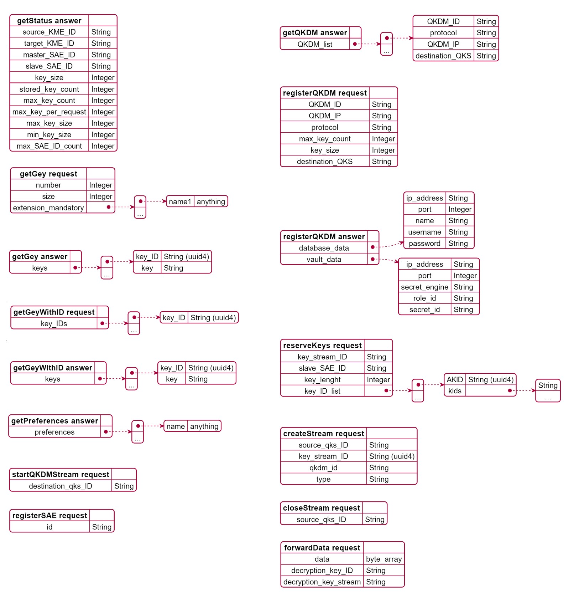
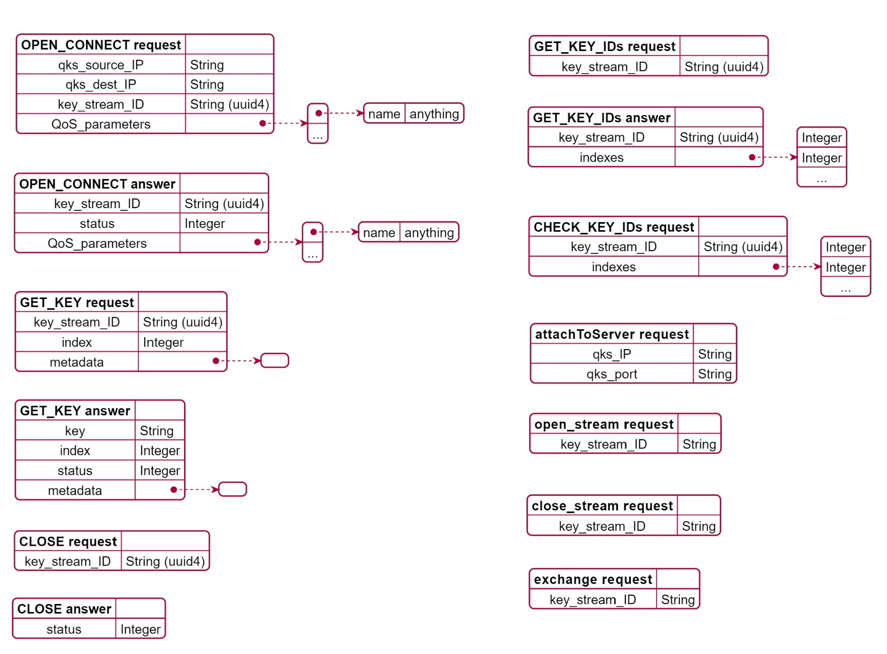

# QUANTUM KEY SERVER APIs
## Northbound interface : SAEs/Admin to QKS

| method                | path  | action| note  | 
|-------                | ----  | ------| ----  |
| **getStatus**         | /api/v1/keys/*<slave_SAE_ID>*/status      | GET    |            |
| **getKey**            | /api/v1/keys/*<slave_SAE_ID>*/enc_keys    | POST   |            |
| **getKeyWithKeyIDs**  | /api/v1/keys/*<master_SAE_ID>*/dec_keys   | POST   |            |
| getPreferences        | /api/v1/preferences                       | GET    | admin only |
| setPreference         | /api/v1/preferences/*<preference>*        | PUT    | admin only |
| getQKDMs              | /api/v1/qkdms                             | GET    | admin only |
| registerSAE           | /api/v1/saes                              | POST   |            |
| unregisterSAE         | /api/v1/saes/*<SAE_ID>*                   | DELETE |            |
| startQKDMStream       | /api/v1/qkdms/*<qkdm_ID>*/streams          | POST   | admin only |
| deleteQKDMStreams     | /api/v1/qkdms/*<qkdm_ID>*/streams          | DELETE | admin only |

## External (QKS to QKS) interface 

| method                | path  | action| note  | 
|-------                | ----  | ------| ----  |
| reserveKeys           | /api/v1/keys/*<master_SAE_ID>*/reserve  | POST   |       |
| forwardData           | /api/v1/forward                         | POST   |       |
| create_stream         | /api/v1/streams                         | POST   |       |
| close_stream          | /api/v1/streams/*<key_stream_ID>*       | DELETE |       |
 

## Southbound interface :  QKD Module to QKS
| method                | path  | action| note  | 
|-------                | ----  | ------| ----  |
| registerQKDM          | /api/v1/qkdms             | POST      |       |
| unregisterQKDM        | /api/vi/qkdms/*<qkdm_ID>* | DELETE    |       |

## JSONs data

# QKD MODULE APIs
## Southbound interface : QKS to QKD Module
| method                | path  | action| note  | 
|-------                | ----  | ------| ----  |
| **open_connect**      | /api/v1/qkdm/actions/open_connect                 | POST  |       |
| **close**             | /api/v1/qkdm/actions/close                        | POST  |       |
| **get_key**           | /api/v1/qkdm/actions/get_key                      | POST  |       |
| get_key_IDs           | /api/v1/qkdm/actions/get_ID/*<key_stream_ID>*     | GET   |       |
| check_key_IDs         | /api/v1/qkdm/actions/check_ID                     | POST  |       |
| attach_to_server      | /api/v1/qkdm/actions/attach                       | POST  |       |

## QKD Module to QKD Module interface
| method                | path  | action| note  | 
|-------                | ----  | ------| ----  |
| open_stream           | /api/v1/qkdm/actions/open_stream      | POST  |       |
| close_stream          | /api/v1/qkdm/actions/close_stream     | POST  |       |
| exchange              | /api/v1/qkdm/actions/exchange         | POST  |       |

## JSONs format 

# Plant UML Codes 
## SERVER

@startjson
{   
    "**getStatus answer**" : "",
	"source_KME_ID": "String",
    "target_KME_ID": "String",
    "master_SAE_ID": "String",
    "slave_SAE_ID": "String",
    "key_size": "Integer",
    "stored_key_count": "Integer",
    "max_key_count": "Integer",
    "max_key_per_request": "Integer",
    "max_key_size": "Integer",
    "min_key_size": "Integer",
    "max_SAE_ID_count": "Integer"
}
@endjson

@startjson
{
    "**getGey request**":"",
    "number": "Integer",
    "size": "Integer",
    "extension_mandatory": [
    {"name1": "anything"},
    "..."
    ]
}
@endjson

@startjson
{
    "**getGey answer**":"",
    "keys": [
    {
    "key_ID": "String (uuid4)",
    "key": "String"
    },
    "..."
    ]
}
@endjson

@startjson
{
    "**getGeyWithID request**":"",
    "key_IDs": [
    { "key_ID": "String (uuid4)" },
    "..."
    ]
}
@endjson

@startjson
{
    "**getGeyWithID answer**":"",
    "keys": [
    {
    "key_ID": "String (uuid4)",
    "key": "String"
    },
    "..."
    ]
}
@endjson

@startjson
{
    "**getPreferences answer**":"",
    "preferences" :[
        {"name" : "anything" },
        "..."
    ]
}
@endjson

@startjson
{
    "**setPreference request**":"",
    "preference" : "String",
    "value" : "anything"
}
@endjson

@startjson
{
    "**getQKDM answer**":"",
    "QKDM_list" : [
        {   "QKDM_ID":"String", 
            "protocol": "String",
            "QKDM_IP" : "String",
            "destination_QKS" : "String" },
        "..."
    ]
}
@endjson

@startjson
{
    "**registerQKDM request**":"",
    "QKDM_ID":"String",
    "QKDM_IP" : "String",
    "QKDM_port" : "Integer", 
    "protocol" : "String",
    "max_key_count" : "Integer", 
    "key_size" : "Integer",
    "destination_QKS" : "String"
}
@endjson

@startjson
{
    "**registerQKDM answer**":"",
    "database_data" : {
        "ip_address" : "String",
        "port" : "Integer", 
        "name" : "String",
        "username" : "String", 
        "password" : "String",
        "auth_src" : "String"
    },
    "vault_data" : {
        "ip_address" : "String",
        "port" : "Integer",
        "secret_engine" : "String",
        "role_id" : "String",
        "secret_id" : "String"
    }
}
@endjson

@startjson
{
    "**registerSAE request**":"",
    "id" : "String"
}
@endjson

@startjson
{
    "**startQKDMStream request**":"",
    "destination_qks_ID" : "String" 
}
@endjson

@startjson
{
    "**reserveKeys request**":"",
    "key_stream_ID" : "String",
    "slave_SAE_ID" : "String", 
    "key_lenght" : "Integer",
    "key_ID_list" :     [ 
        { "AKID": "String (uuid4)",
            "kids" : ["String", "..." ]},
        "..."
    ]
}
@endjson

@startjson
{
    "**createStream request**":"",
    "source_qks_ID" : "String",
    "key_stream_ID" : "String (uuid4)",
    "qkdm_id" : "String",
    "type" : "String"
}
@endjson

@startjson
{
    "**closeStream request**":"",
    "source_qks_ID" : "String"
}
@endjson

@startjson
{
    "**forwardData request**":"",
    "data" : "byte_array",
    "decryption_key_ID" : "String",
    "decryption_key_stream" : "String"
}
@endjson

## QKD MODULE

@startjson
{
    "**CLOSE answer**":"",
    "status" : "Integer"
}
@endjson

@startjson
{
    "**CLOSE request**":"",
    "key_stream_ID" : "String (uuid4)"
}
@endjson

@startjson
{
    "**OPEN_CONNECT request**":"",
    "qks_source_IP": "String", 
    "qks_dest_IP" : "String", 
    "key_stream_ID" : "String (uuid4)",
    "QoS_parameters" : [
        {"name" : "anything"},
        "..."
    ]
}
@endjson

@startjson
{
    "**OPEN_CONNECT answer**":"",
    "key_stream_ID" : "String (uuid4)",
    "status" : "Integer",
    "QoS_parameters" : [
        {"name" : "anything"},
        "..."
    ]
    
}
@endjson

@startjson
{
    "**GET_KEY request**":"",
    "key_stream_ID" : "String (uuid4)",
    "index" : "Integer",
    "metadata" : {}
    
}
@endjson

@startjson
{
    "**GET_KEY answer**":"",
    "key" : "String",
    "index" : "Integer",
    "status" : "Integer",
    "metadata" : {}
    
}
@endjson

@startjson
{
    "**GET_KEY_IDs request**":"",
    "key_stream_ID" : "String (uuid4)"
}
@endjson

@startjson
{
    "**GET_KEY_IDs answer**":"",
    "key_stream_ID" : "String (uuid4)",
    "indexes" : ["Integer", "Integer", "..."] 
}
@endjson

@startjson
{
    "**CHECK_KEY_IDs request**":"",
    "key_stream_ID" : "String (uuid4)",
    "indexes" : ["Integer", "Integer", "..."] 
}
@endjson

@startjson
{
    "**attachToServer request**":"",
    "qks_IP" : "String",
    "qks_port" : "String"
}
@endjson

@startjson
{
    "**open_stream request**":"",
    "key_stream_ID" : "String"
}
@endjson

@startjson
{
    "**close_stream request**":"",
    "key_stream_ID" : "String"
}
@endjson

@startjson
{
    "**exchange request**":"",
    "key_stream_ID" : "String"
}
@endjson
