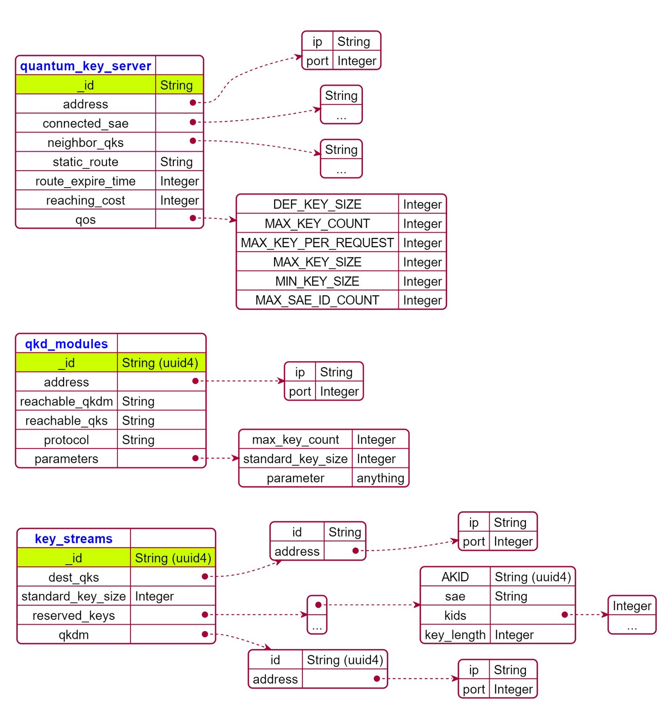
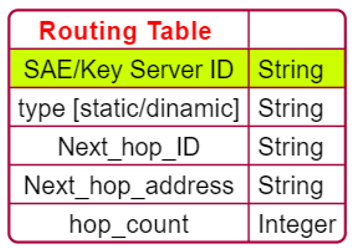
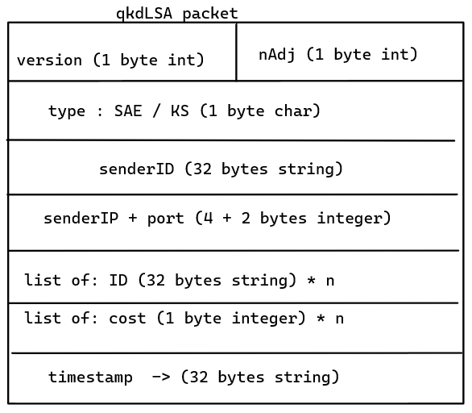

# DB model 

## MongoDB view 

## Routing model

# PlantUML JSON Codes

@startjson
#highlight "_id"
{
    "<color:blue>**quantum_key_server**" : "", 
    "_id": "String",
    "address" : {
      "ip" : "String", 
      "port" : "Integer"
    },
	"connected_sae" : [
		"String",
		"..."
	],
	"neighbor_qks" : [
		"String",
		"..."
	],
	"static_route" : "String"
}
@endjson

@startjson
#highlight "_id"
{
"<color:blue>**qkd_modules**" : "", 
  	"_id": "String (uuid4) ", 
	"address" : {
      "ip" : "String", 
      "port" : "Integer"
    },
	"reachable_qkdm" : "String",
	"reachable_qks" : "String", 
	"protocol" : "String", 
	"parameters" : {
		"max_key_count" : "Integer",
		"standard_key_size" : "Integer", 
		"parameter" : "anything"
	}
}
@endjson

@startjson
#highlight "_id"
{
"<color:blue>**key_streams**" : "", 
	"_id": "String (uuid4)",
	"dest_qks" : {
		"id": "String", 
		"address" : {
      "ip" : "String", 
      "port" : "Integer"
    }
	}, 
	"standard_key_size" : "Integer",
	"max_key_count" : "Integer", 
	"reserved_keys" : 
		[
			{ 
			"AKID" : "String (uuid4)",
			"sae" : "String",  
			"kids" : ["Integer", "..."] ,
			"key_length" : "Integer"
			} ,
			"..."
		],
	"qkdm" : {
		"id": "String (uuid4)", 
		"address" : {
      "ip" : "String", 
      "port" : "Integer"
    },
	"master_key_id" : "String"
	}
}
@endjson

@startjson
#highlight "SAE ID" 
{
"<color:red>**Routing Table **" : "", 
  	"SAE ID" : "String", 
	"type " : "[static/dinamic]",
	"next hop id" : "String", 
	"next hop address" : {"ip" :"String", "port" : "Integer"},
	"cost" : "Integer" ,
	"length" : "Integer" 
}
@endjson

