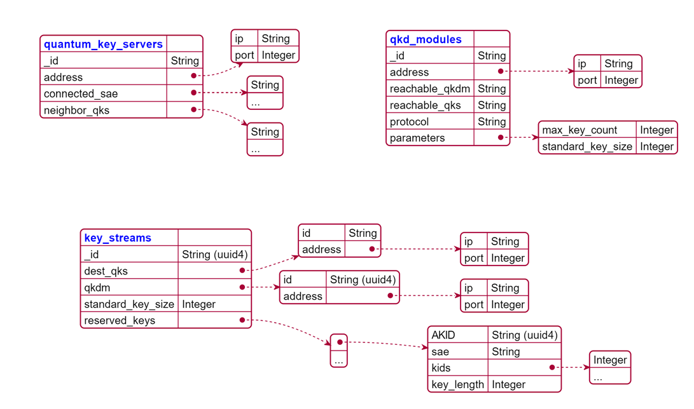
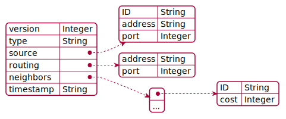
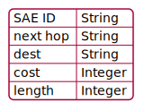

# DB model 

## MongoDB view 

## Routing packet

## Routing tables

<!-- 
# PlantUML JSON Codes

@startjson

{
    "<color:blue>**quantum_key_servers**" : "", 
    "_id": "String",
    "address" : {
      "ip" : "String", 
      "port" : "Integer"
    },
	"connected_sae" : [
		"String",
		"..."
	],
	"neighbor_qks" : [
		"String",
		"..."
	]
}
@endjson

@startjson

{
"<color:blue>**qkd_modules**" : "", 
  	"_id": "String", 
	"address" : {
      "ip" : "String", 
      "port" : "Integer"
    },
	"reachable_qkdm" : "String",
	"reachable_qks" : "String", 
	"protocol" : "String", 
	"parameters" : {
		"max_key_count" : "Integer",
		"standard_key_size" : "Integer"
	}
}
@endjson

@startjson

{
"<color:blue>**key_streams**" : "", 
	"_id": "String (uuid4)",
	"dest_qks" : {
		"id": "String", 
		"address" : {
      "ip" : "String", 
      "port" : "Integer"
    }
	}, 
		"qkdm" : {
		"id": "String (uuid4)", 
		"address" : {
      		"ip" : "String", 
      		"port" : "Integer"
    	}
	},
	"standard_key_size" : "Integer",
	"reserved_keys" : 
		[
			{ 
			"AKID" : "String (uuid4)",
			"sae" : "String",  
			"kids" : ["Integer", "..."] ,
			"key_length" : "Integer"
			} ,
			"..."
		]

	
}
@endjson

@startjson

{
"<color:red>**Routing Table **" : "", 
  	"SAE_ID" : "String", 
	"next_hop" : "String", 
	"dest" : "String", 
	"cost" : "Integer" ,
	"length" : "Integer" 
}
@endjson

@startjson

{
    "version" : "Integer", 
    "type" : "String", 
    "source" : {
        "ID" : "String", 
        "address" : "String",
        "port" : "Integer"
    }, 
    "routing" : {
        "address" : "String", 
        "port" : "Integer"
    }, 
	"forwarder" : "String",
    "neighbors" : [
        {
            "ID" : "String",
            "cost" : "Integer"
        },
		"..."
    ],
    "timestamp" : "String",
	"authentication" : "String"

}
@endjson -->